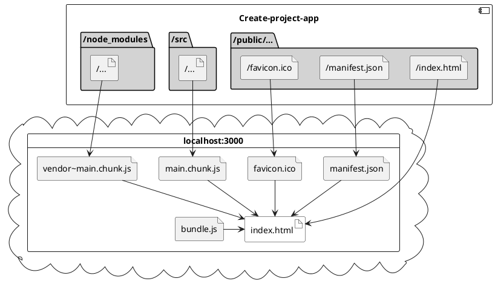

# First stackBlitz JS project

> To build a software that your users understand, capture the language of that users in a class diagram.” ― Michael Jesse Chonoles, UML 2 for Dummies.
> [Uml Quotes - Goodreads](https://www.goodreads.com)

UML is **very** ~~convoluted~~ convinient!

|: Name1 |: name2 |
|: ..... |: ..... |
|: val 1 |: val 2 |

