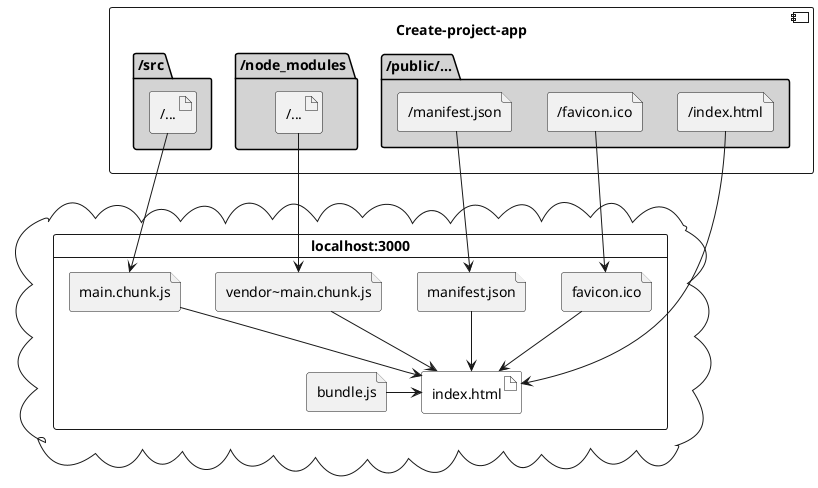

# First stackBlitz JS project

> To build a software that your users understand, capture the language of that users  in a class diagram.” ― Michael Jesse Chonoles, UML 2 for Dummies.
[Uml Quotes - Goodreads](https://www.goodreads.com)

UML is **very** ~~convoluted~~ convinient!

| Attribute           | AngularJS      | Angular 2  | React    |
| :------------------ | :------------: | :--------: | --------:|
| Author              | Google         | Google     | Facebook |
| Language            | JavaScript/HTML| TypeScript | JSX      |
| Size                | 143k           | 764k       | 151k     |
| Github Stars        | 46.4k          | 8.4k	    | 34.4k    |
| Github Contributors |	1,386	       | 189	    | 604      |

 
